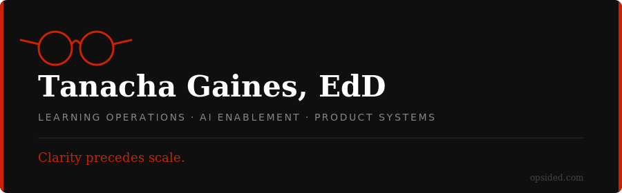

  

I build the **systems behind learning at scale** — operating models, workforce architecture, and AI-enabled workflows that make enterprise delivery visible, governable, and built to compound. 15+ years across consulting, product, and operations.

---

  

`AI Enablement` `Learning Operations` `Workforce Architecture` `Product Systems` `Change Management`

---

<h4>CURRENT PROJECTS</h4>

<table>
<tr>
<td style="border-left: 3px solid #cc2200; padding: 12px;">
  <strong>Lightway</strong> 
  Advocacy engagement platform — progressive behavior model 
  <a href="https://lightandcover.org/lightway"><code>Live, Beta</code></a>
</td>
<td style="border-left: 3px solid #cc2200; padding: 12px;">
  <strong>Stress Quest</strong> 
  Workplace resilience learning game 
  <a href="https://stress-quest-game.web.app"><code>Live, Beta</code></a>
</td>
</tr>
<tr>
<td style="border-left: 3px solid #cc2200; padding: 12px;">
  <strong>HILT</strong> 
  Human-in-the-loop AI training for learning designers 
  <code>In Development</code>
</td>
<td style="border-left: 3px solid #cc2200; padding: 12px;">
  <strong>Portfolio</strong> 
  Learning ops & AI work — full case studies 
  <a href="https://github.com/tnacha/portfolio"><code>View</code></a>
</td>
</tr>
</table>

---

<h4>CONNECT</h4>

<a href="https://opsided.com">opsided.com</a> &nbsp;&nbsp; <a href="https://linkedin.com/in/tanacha">LinkedIn</a> &nbsp;&nbsp; <a href="https://opsided.com">Portfolio</a>
