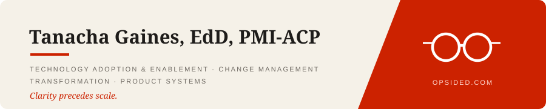
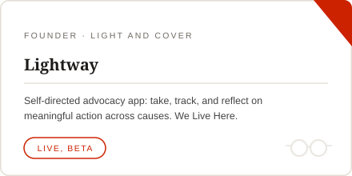
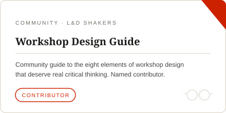

  

I build the **systems behind adoption, enablement, and product at scale**: operating models, capability architecture, and AI-enabled workflows that make enterprise delivery visible, governable, and built to compound. 15+ years across consulting, product, and operations.

---

`AI Enablement` `Change Management` `Technology Adoption` `Product Systems` `Capability Architecture` `Learning Operations`

---

## Selected Work

*From enterprise operations to independent experiments*

<table>
<tr>
<td width="33%" valign="top"></td>
<td width="33%" valign="top"></td>
<td width="33%" valign="top"></td>
</tr>
</table>

---

<h4>CONNECT</h4>

<a href="https://opsided.com">opsided.com</a> &nbsp;&nbsp; <a href="https://linkedin.com/in/tanacha">LinkedIn</a> &nbsp;&nbsp; <a href="https://github.com/tnacha/portfolio">Portfolio</a> &nbsp;&nbsp; <a href="https://github.com/tnacha/resume">Resume</a>
